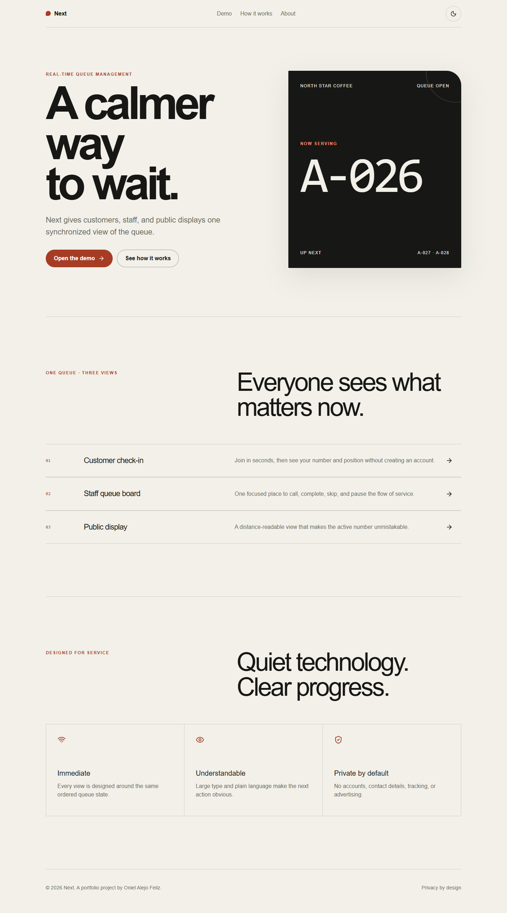
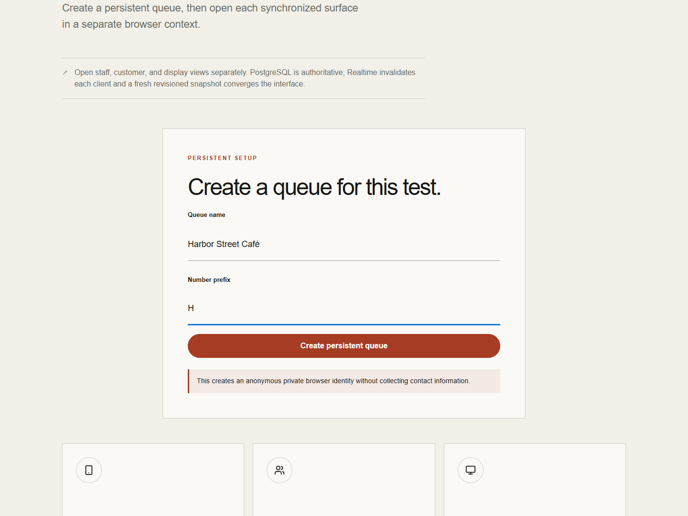
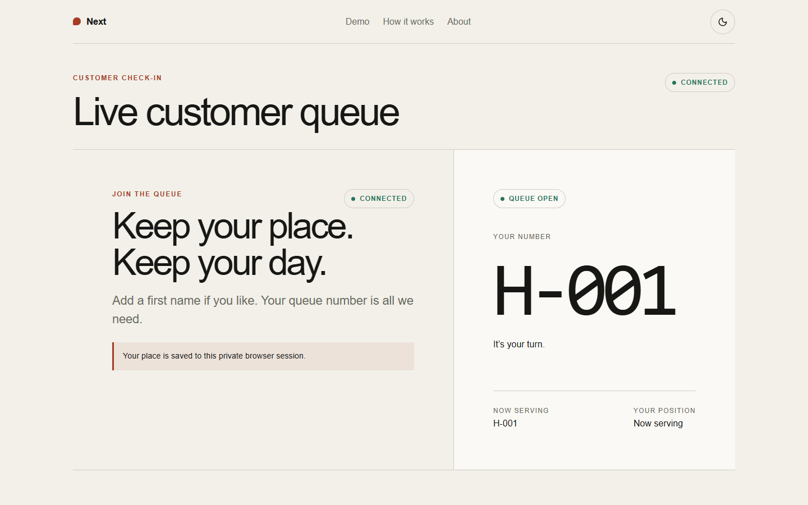
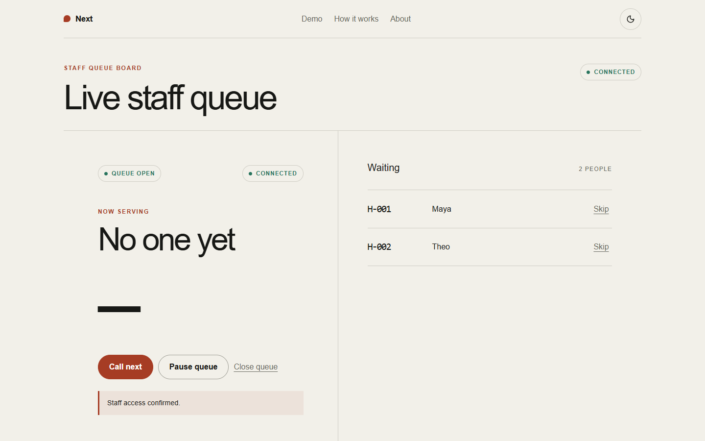
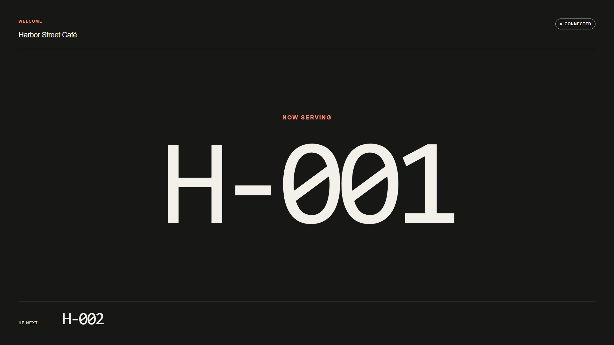
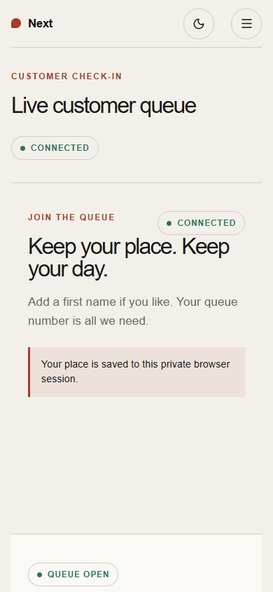
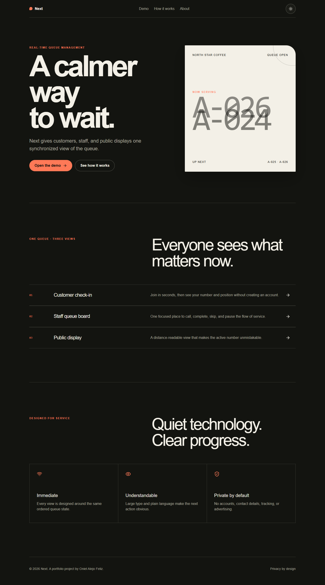
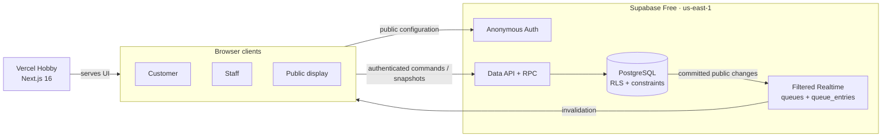
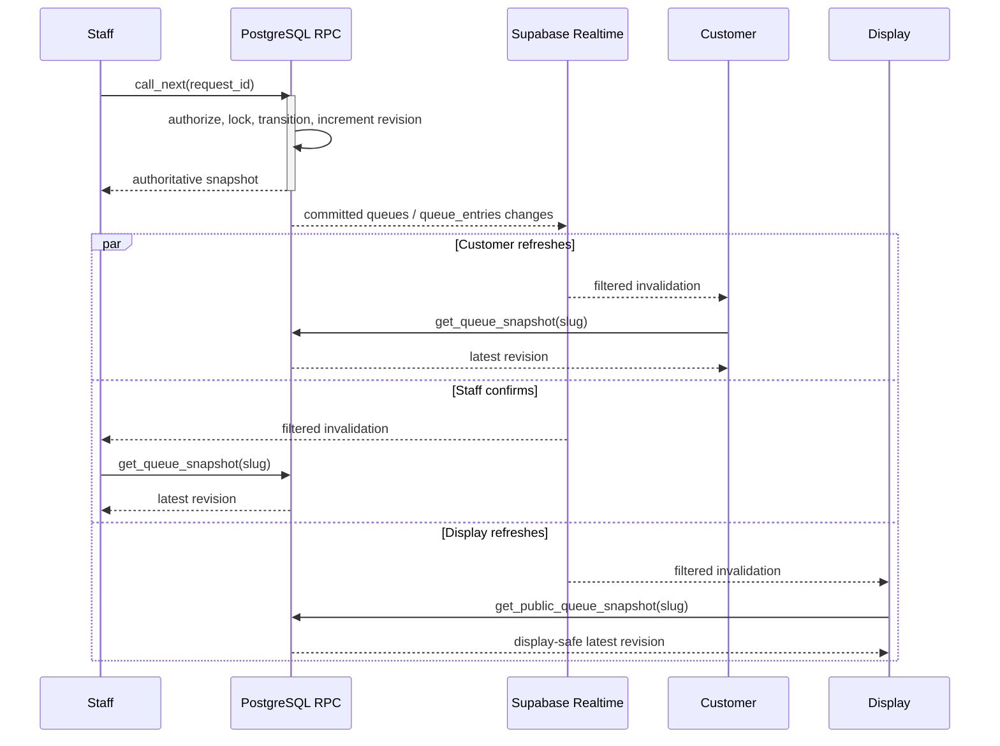
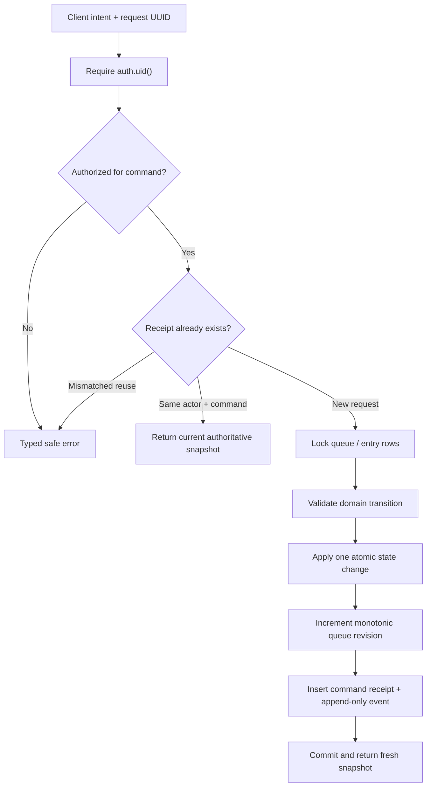

# Next — Real-Time Queue System

> A calm, persistent queue for small service teams, built as a production-ready portfolio project by Oniel Alejo Feliz.

[Live application](https://next-queue-omega.vercel.app) · [Try the demo](https://next-queue-omega.vercel.app/demo) · [Watch the 27-second demo](docs/assets/video/next-v1-demo.mp4) · [Read the v1.0 release notes](docs/releases/v1.0.0.md)



## Product overview

Next gives customers, staff, and a public display one synchronized answer to three questions: who is waiting, who is being served, and who is next. It replaces paper lists and shouted names with an intentionally small workflow that works without permanent accounts, contact details, tracking, or paid infrastructure.

The v1.0 product includes:

- anonymous queue creation with a one-time staff capability
- customer check-in, stable queue number, position, and turn status
- a staff board for call, complete, skip, pause, reopen, and close commands
- a distance-readable public display containing queue numbers only
- persistent PostgreSQL state and multi-client Realtime convergence
- responsive light/dark presentation, reduced motion, and accessible status feedback

## Live demo

Open the [production demo](https://next-queue-omega.vercel.app/demo), create a synthetic queue, and save the one-time staff code privately. The creator is authorized immediately. Open customer, staff, and display routes in separate tabs or browser profiles to see changes converge without refresh.

Use synthetic information only. An optional customer first name is visible only to authorized staff. Clearing browser data loses that anonymous identity, and a lost staff code cannot be recovered through the product.

## Screenshots

| Queue creation                                                           | Customer status                                                       |
| ------------------------------------------------------------------------ | --------------------------------------------------------------------- |
|  |  |

| Staff board                                                                                | Public display                                                                          |
| ------------------------------------------------------------------------------------------ | --------------------------------------------------------------------------------------- |
|  |  |

| Mobile                                                                         | Dark theme                                                                 |
| ------------------------------------------------------------------------------ | -------------------------------------------------------------------------- |
|  |  |

All portfolio media was captured from production with a temporary synthetic queue. The queue, related rows, anonymous identities, and one-time capability were removed after capture.

## Architecture

Next.js serves the interface from Vercel. The browser uses only a Supabase project URL and publishable key; authorization and state transitions remain inside PostgreSQL.



The database has eight application tables. Public state lives in `queues` and `queue_entries`; private names, ownership, staff membership, access hashes, rate-limit attempts, idempotency receipts, and events remain outside the Realtime publication. See the [data model](docs/architecture/data-model.md) and [architecture decision record](docs/architecture/adr-002-supabase-realtime.md).

## Data flow

Customer, staff, and display clients subscribe independently. Realtime messages are treated as invalidations, not authoritative state: every signal produces a fresh revisioned snapshot.



## Database command flow

Clients cannot write tables directly. Every mutation crosses an explicit security-definer RPC with a caller-generated request UUID.



## Security and privacy

- Supabase anonymous Auth creates a browser-scoped UUID without email, phone, password, or social identity.
- The application runtime contains no service-role key, database password, or Supabase access token.
- All eight public-schema tables have RLS; direct writes are revoked from browser roles.
- Staff access is a queue-scoped capability. Only a `pgcrypto` hash is stored; the raw code is returned once and never enters a URL, event, log, seed, or Realtime payload.
- Optional names live in `queue_entry_private`. Public snapshots and displays expose number labels only.
- Failed staff claims are throttled per anonymous identity and queue. This is basic abuse resistance, not enterprise bot protection.
- No analytics, advertising, uploads, contact collection, or visitor profiling is enabled.

The full threat and authorization model is documented in [authorization and security](docs/security/authorization.md).

## Concurrency and idempotency

Commands execute in database transactions with queue/entry row locks. A partial unique index enforces at most one `SERVING` entry per queue, while unique `(queue_id, sequence)` and `(queue_id, number_label)` constraints prevent duplicate or reused numbers.

Every intent receives a request UUID. Automatic retry reuses that UUID; the database records one command receipt, returns the existing result for a valid replay, and rejects mismatched reuse. Concurrent `call_next` requests therefore produce one winner and a typed conflict without violating the one-serving invariant.

## Realtime synchronization

Only display-safe `queues` and `queue_entries` rows are published. Each client subscribes with a queue-ID filter, debounces related transaction messages for 75 ms, fetches a full snapshot, and ignores stale revisions. A refresh already in flight queues at most one follow-up.

Clients resynchronize after initial subscription, browser `online`, channel recovery, and a meaningful visibility return. The visible state returns to connected only after an authoritative refresh succeeds. Healthy clients do not poll. See the [Realtime protocol](docs/architecture/realtime-protocol.md).

## Testing

The release evidence contains 130 passing automated checks without double-counting the Realtime unit subset:

| Layer                  | Passing checks | What it covers                                                                                          |
| ---------------------- | -------------: | ------------------------------------------------------------------------------------------------------- |
| Vitest unit/component  |             33 | transitions, UI behavior, session handling, revision convergence; includes 9 focused Realtime tests     |
| pgTAP database         |             62 | RLS, grants, constraints, functions, privacy, publication, concurrency, idempotency                     |
| Supabase integration   |             11 | persistent commands and authorization through the public client                                         |
| Playwright application |             15 | end-to-end workflows and multi-client synchronization                                                   |
| Production smoke       |              9 | public health, metadata, accessibility, console cleanliness, responsive overflow; remote-data read-only |

CI runs formatting, lint, type generation/typecheck, unit tests, production build, dependency audit, a clean local Supabase migration replay, database lint, pgTAP, generated-type verification, integration tests, and browser tests.

## Accessibility

The interface uses semantic landmarks, one page heading, labeled forms, keyboard-reachable controls, visible focus, skip links, readable connection states, and status announcements. Queue state never relies on color alone. Automated Axe checks report zero serious or critical findings across public and application routes.

Manual production QA covered keyboard-only navigation, focus retention during Realtime updates, 200% zoom, 320–1440 px layouts, a 1920×1080 public display, dark theme, and reduced motion. Details are in the [production validation report](docs/releases/story-3-production-validation.md).

## Deployment

- **Application:** Vercel Hobby, production branch `main`, Node.js 22.x
- **Database/Auth/Realtime:** one Supabase Free project in `us-east-1`
- **Canonical URL:** [next-queue-omega.vercel.app](https://next-queue-omega.vercel.app)
- **Production browser variables:** `NEXT_PUBLIC_SUPABASE_URL` and `NEXT_PUBLIC_SUPABASE_PUBLISHABLE_KEY` only
- **Migrations:** forward-only SQL in `supabase/migrations`, replayed from a clean database in CI

No custom domain, paid analytics, paid storage, add-on, trial, payment method, or usage-based service is active.

## Free-tier limitations

This portfolio deployment has no commercial SLA. Supabase Free may pause an inactive project and both providers impose finite compute, database, bandwidth, build, function, and connection limits. The design is appropriate for small queues, not unbounded traffic or enterprise operations.

Anonymous ownership is lost when browser data is cleared. A lost one-time staff code is unrecoverable without an already-authorized session. Automated anonymous-user retention, capability recovery/rotation, distributed rate limiting, monitoring, backups, and formal support are outside v1.0.

## Local setup

Requirements: Node.js 22, npm, and Docker Desktop (or a compatible Docker runtime with roughly 7 GB available).

```bash
git clone https://github.com/XonkelX/next-queue.git
cd next-queue
npm install
npm run db:start
npm run db:reset
```

Copy `.env.example` to `.env.local`, then use the local API URL and **publishable** key shown by `npm run db:status`. Never put a service-role key in a browser variable.

```bash
npm run dev
```

Open [http://localhost:3000/demo](http://localhost:3000/demo). The deterministic `north-star-cafe` seed contains display-safe visual data and intentionally has no recoverable staff code.

Useful validation commands:

```bash
npm run format:check
npm run lint
npm run typecheck
npm test
npm run build
npm audit
```

Database and browser validation additionally use `npm run db:test`, `npm run test:integration`, and `npm run test:e2e`. `npm run db:reset` affects the local database only.

## Documentation

- [Product scope](docs/product/scope.md)
- [Data model](docs/architecture/data-model.md)
- [Realtime architecture decision](docs/architecture/adr-002-supabase-realtime.md)
- [Realtime protocol](docs/architecture/realtime-protocol.md)
- [Authorization and security](docs/security/authorization.md)
- [Motion system](docs/design/motion-system.md)
- [Production validation](docs/releases/story-3-production-validation.md)
- [v1.0.0 release notes](docs/releases/v1.0.0.md)

## License

No open-source license has been granted. The repository is presented as a portfolio project; all rights are reserved by Oniel Alejo Feliz.
