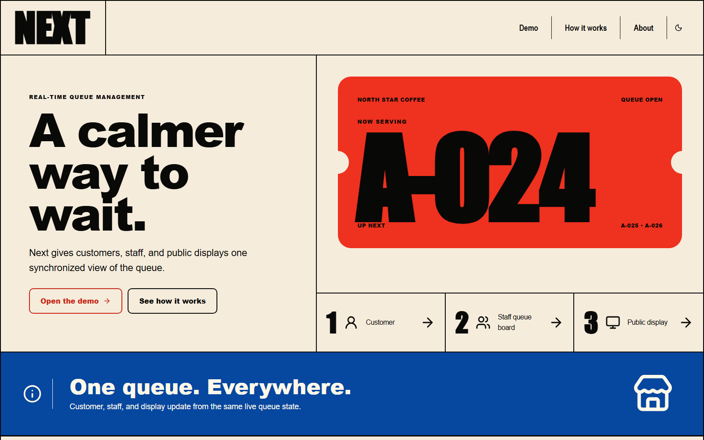
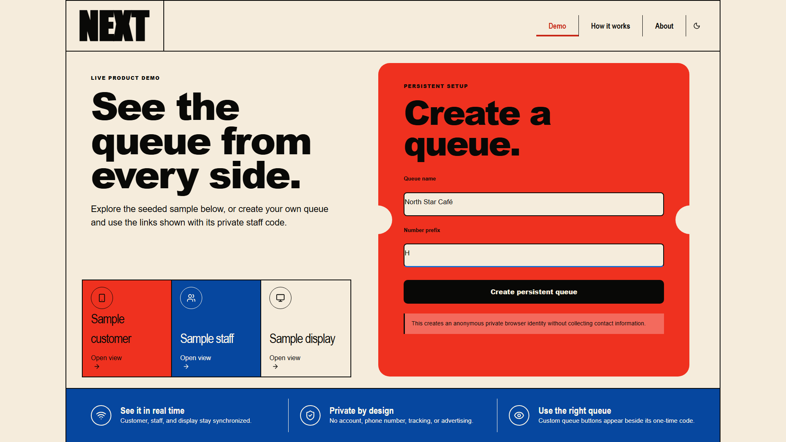
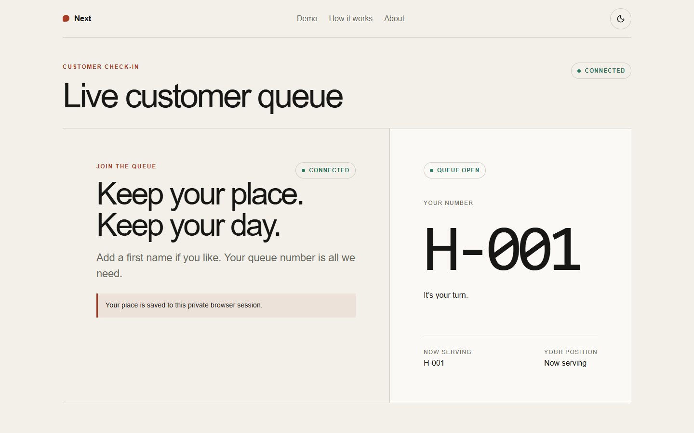
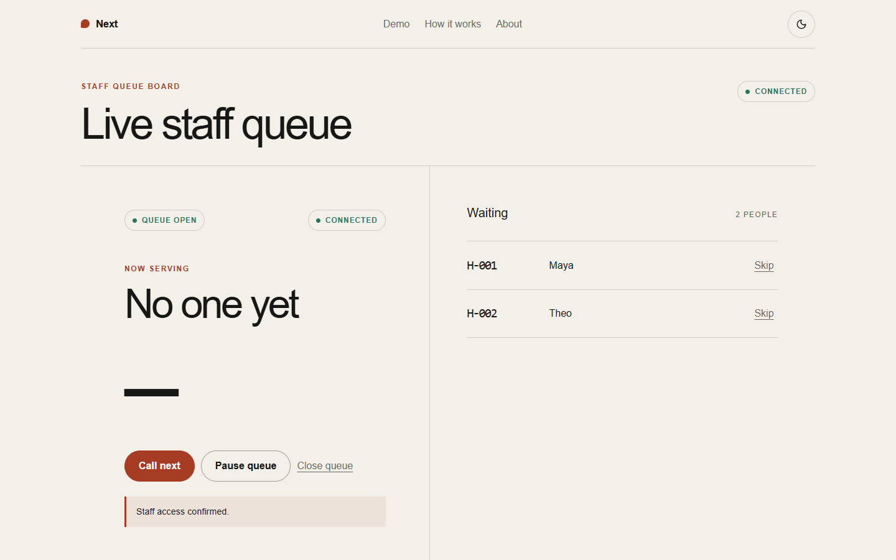
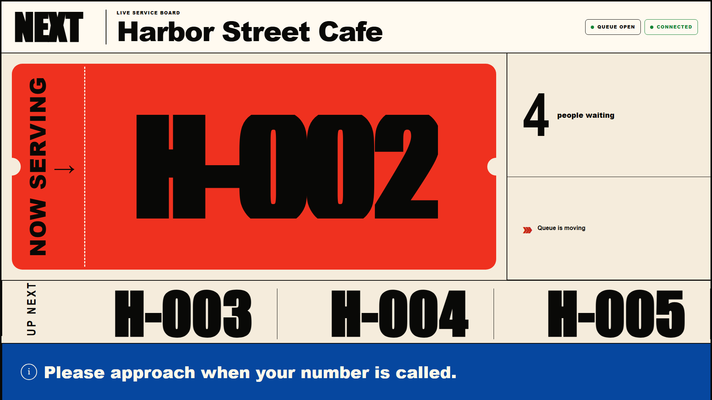
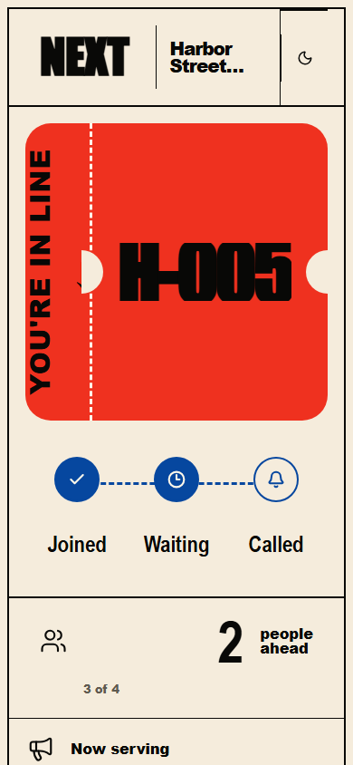
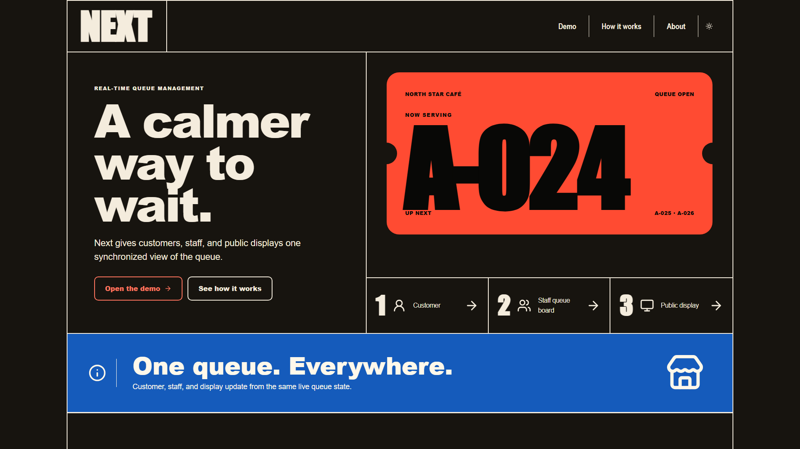
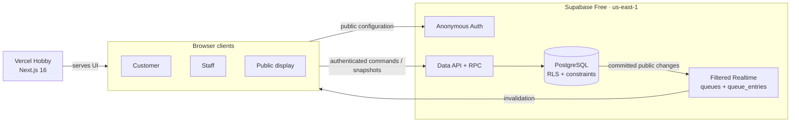
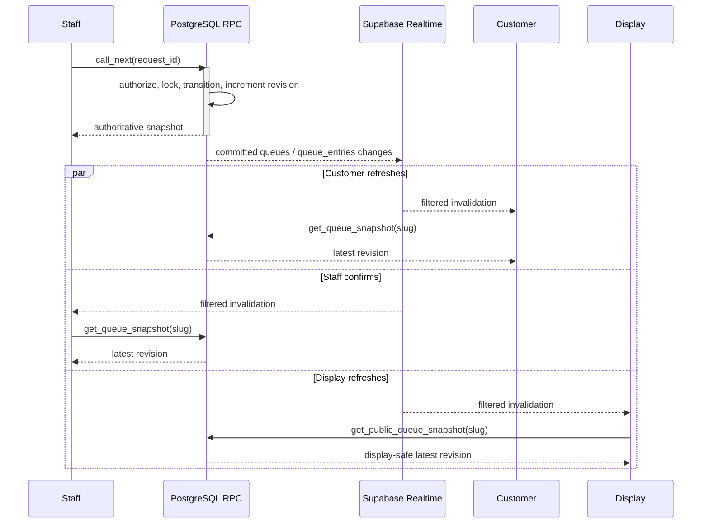
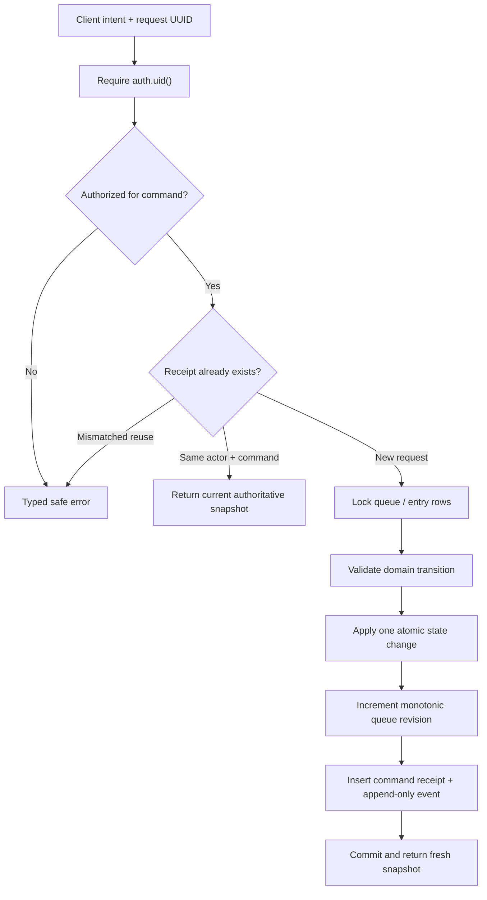

# Next — Real-Time Queue System

> A calm, persistent queue for small service teams, for managing customer arrivals and service.

[Live application](https://next-queue-omega.vercel.app) · [Create a queue](https://next-queue-omega.vercel.app/create) · [Read the v1.0 release notes](docs/releases/v1.0.0.md)



## Product overview

Next gives customers, staff, and a public display one synchronized answer to three questions: who is waiting, who is being served, and who is next. It replaces paper lists and shouted names with an intentionally small workflow that works without permanent accounts, contact details or marketing trackers.

The v1.0 product includes:

- anonymous queue creation with a one-time staff capability
- customer check-in, stable queue number, position, and turn status
- a staff board for call, complete, skip, pause, reopen, and close commands
- a distance-readable public display containing queue numbers only
- persistent PostgreSQL state and multi-client Realtime convergence
- responsive light/dark presentation, reduced motion, and accessible status feedback

## Start a queue

Open [queue setup](https://next-queue-omega.vercel.app/create), create a queue for your venue, and save the one-time staff code privately. The creator is authorized immediately. Open customer, staff, and display routes in separate tabs or browser profiles to see changes converge without refresh.

An optional first name is visible to its customer and authorized staff. My queues restores staff boards in the same browser. A creator can replace a lost staff code and revoke other staff sessions; losing both the original browser identity and the code still prevents recovery. Queue links and locally generated QR codes are available on the staff board.

## Screenshots

| Queue creation                                                           | Customer status                                                       |
| ------------------------------------------------------------------------ | --------------------------------------------------------------------- |
|  |  |

| Staff board                                                                                 | Public display                                                                          |
| ------------------------------------------------------------------------------------------- | --------------------------------------------------------------------------------------- |
|  |  |

| Mobile                                                                         | Dark theme                                                                 |
| ------------------------------------------------------------------------------ | -------------------------------------------------------------------------- |
|  |  |

All product media was captured from the final production build with a temporary synthetic queue. The queue, related rows, anonymous identities, and one-time capability were removed after capture.

## Typography

The interface aims to feel clear, welcoming and operational, avoiding cramped reading and decorative controls. Anton remains on short headings and ticket numbers; Barlow 400/500/600/700 carries paragraphs, labels, navigation and buttons. Next.js self-hosts both families through `next/font` with `display: swap`.

Three systems were compared: Anton + Barlow Condensed retains the original density but crowds small controls; Anton + Barlow preserves the ticket character while improving reading and hierarchy; system sans alone minimizes downloads but loses that visual identity. The selected pair uses two families, Arial/Impact fallbacks and container-aware ticket sizing for longer identifiers. English copy, accented names, ticket numbers and mobile wrapping are the main validation content.

Font sources and exact SIL OFL 1.1 license copies: [Barlow source](https://github.com/google/fonts/tree/main/ofl/barlow), [Barlow license](public/licenses/Barlow-OFL.txt), [Anton source](https://github.com/google/fonts/tree/main/ofl/anton), [Anton license](public/licenses/Anton-OFL.txt). Loading and role mapping live in `src/app/layout.tsx`, `ticket-theme.css` and `product-ui.css`.

## Architecture

Next.js serves the interface from Vercel. The browser uses only a Supabase project URL and publishable key; authorization and state transitions remain inside PostgreSQL.


```mermaid
flowchart LR
  subgraph Clients["Browser clients"]
    Customer["Customer"]
    Staff["Staff"]
    Display["Public display"]
  end

  Vercel["Vercel Hobby<br/>Next.js 16"]

  subgraph Supabase["Supabase Free · us-east-1"]
    Auth["Anonymous Auth"]
    API["Data API + RPC"]
    DB[("PostgreSQL<br/>RLS + constraints")]
    RT["Filtered Realtime<br/>queues + queue_entries"]
  end

  Vercel -->|"serves UI"| Clients
  Clients -->|"public configuration"| Auth
  Clients -->|"authenticated commands / snapshots"| API
  API --> DB
  DB -->|"committed public changes"| RT
  RT -->|"invalidation"| Clients
```

The database has eight public application tables plus a private queue-link access table. Public state lives in `queues` and `queue_entries`; private names, ownership, staff membership, access hashes, rate-limit attempts, idempotency receipts, and events remain outside the Realtime publication. See the [data model](docs/architecture/data-model.md) and [architecture decision record](docs/architecture/adr-002-supabase-realtime.md).

## Data flow

Customer, staff, and display clients subscribe independently. Realtime messages are treated as invalidations, not authoritative state: every signal produces a fresh revisioned snapshot.


```mermaid
sequenceDiagram
  participant Staff
  participant RPC as PostgreSQL RPC
  participant RT as Supabase Realtime
  participant Customer
  participant Display

  Staff->>RPC: call_next(request_id)
  activate RPC
  RPC->>RPC: authorize, lock, transition, increment revision
  RPC-->>Staff: authoritative snapshot
  deactivate RPC
  RPC-->>RT: committed queues / queue_entries changes
  par Customer refreshes
    RT-->>Customer: filtered invalidation
    Customer->>RPC: get_queue_snapshot(slug)
    RPC-->>Customer: latest revision
  and Staff confirms
    RT-->>Staff: filtered invalidation
    Staff->>RPC: get_queue_snapshot(slug)
    RPC-->>Staff: latest revision
  and Display refreshes
    RT-->>Display: filtered invalidation
    Display->>RPC: get_public_queue_snapshot(slug)
    RPC-->>Display: display-safe latest revision
  end
```

## Database command flow

Clients cannot write tables directly. Every mutation crosses an explicit security-definer RPC with a caller-generated request UUID.


```mermaid
flowchart TD
  A["Client intent + request UUID"] --> B["Require auth.uid()"]
  B --> C{"Authorized for command?"}
  C -->|"No"| X["Typed safe error"]
  C -->|"Yes"| D{"Receipt already exists?"}
  D -->|"Same actor + command"| R["Return current authoritative snapshot"]
  D -->|"Mismatched reuse"| X
  D -->|"New request"| E["Lock queue / entry rows"]
  E --> F["Validate domain transition"]
  F --> G["Apply one atomic state change"]
  G --> H["Increment monotonic queue revision"]
  H --> I["Insert command receipt + append-only event"]
  I --> J["Commit and return fresh snapshot"]
```

## Security and privacy

- Supabase anonymous Auth creates a browser-scoped UUID without email, phone, password, or social identity.
- The application runtime contains no service-role key, database password, or Supabase access token.
- All eight public-schema tables have RLS; direct writes are revoked from browser roles.
- Staff access is a queue-scoped capability. Only a `pgcrypto` hash is stored; the raw code is returned once and never enters a URL, event, log, seed, or Realtime payload.
- Optional names live in `queue_entry_private`. Public snapshots and displays expose number labels only.
- Failed staff claims are throttled per anonymous identity and queue. This is basic abuse resistance, not enterprise bot protection.
- No analytics, advertising, uploads, contact collection, or visitor profiling is enabled.

The full threat and authorization model is documented in [authorization and security](docs/security/authorization.md).

The production dependency audit is clean. The full development audit currently reports the upstream `braces` advisory [GHSA-vfj7-8cjw-p6xm](https://github.com/advisories/GHSA-vfj7-8cjw-p6xm), inherited by the Next.js ESLint tooling. CI gates production dependencies with `npm audit --omit=dev`; it does not treat that development advisory as resolved. Do not downgrade the framework lint configuration to bypass it.

Terminal ticket history has a 30-day retention policy with a rollout grace period. Account recovery and CAPTCHA integrations require the service activation steps below. The hosted database remains on its existing Free plan.

## Concurrency and idempotency

Commands execute in database transactions with queue/entry row locks. A partial unique index enforces at most one `SERVING` entry per queue, while unique `(queue_id, sequence)` and `(queue_id, number_label)` constraints prevent duplicate or reused numbers.

Every intent receives a request UUID. Automatic retry reuses that UUID; the database records one command receipt, returns the existing result for a valid replay, and rejects mismatched reuse. Concurrent `call_next` requests therefore produce one winner and a typed conflict without violating the one-serving invariant.

## Realtime synchronization

Only display-safe `queues` and `queue_entries` rows are published. Each client subscribes with a queue-ID filter, debounces related transaction messages for 75 ms, fetches a full snapshot, and ignores stale revisions. A refresh already in flight queues at most one follow-up.

Clients resynchronize after initial subscription, browser `online`, channel recovery, and a meaningful visibility return. The visible state returns to connected only after an authoritative refresh succeeds. Healthy clients do not poll. See the [Realtime protocol](docs/architecture/realtime-protocol.md).

## Testing

The original v1.0 release evidence below is historical. The October hardening adds regression coverage for terminal tickets, create replay recovery, atomic staff advancement, four-digit tickets and queue-link privacy.

| Layer                  | Passing checks | What it covers                                                                                          |
| ---------------------- | -------------: | ------------------------------------------------------------------------------------------------------- |
| Vitest unit/component  |             34 | transitions, UI behavior, session handling, revision convergence; includes 9 focused Realtime tests     |
| pgTAP database         |             62 | RLS, grants, constraints, functions, privacy, publication, concurrency, idempotency                     |
| Supabase integration   |             11 | persistent commands and authorization through the public client                                         |
| Playwright application |             15 | end-to-end workflows and multi-client synchronization                                                   |
| Production smoke       |              9 | public health, metadata, accessibility, console cleanliness, responsive overflow; remote-data read-only |

CI runs formatting, lint, type generation/typecheck, unit tests, production build, dependency audit, a clean local Supabase migration replay, database lint, pgTAP, generated-type verification, integration tests, and browser tests.

## Accessibility

The interface uses semantic landmarks, one page heading, labeled forms, keyboard-reachable controls, visible focus, skip links, readable connection states, and status announcements. Queue state never relies on color alone. Automated Axe checks report zero serious or critical findings across public and application routes.

Manual production QA covered keyboard-only navigation, focus retention during Realtime updates, 200% zoom, 320–1440 px layouts, a 1920×1080 public display, dark theme, and reduced motion. Details are in the [production validation report](docs/releases/story-3-production-validation.md).

## Deployment

- **Application:** Vercel Hobby, production branch `main`, Node.js 22.x
- **Database/Auth/Realtime:** one Supabase Free project in `us-east-1`
- **Canonical URL:** [next-queue-omega.vercel.app](https://next-queue-omega.vercel.app)
- **Production browser variables:** `NEXT_PUBLIC_SUPABASE_URL` and `NEXT_PUBLIC_SUPABASE_PUBLISHABLE_KEY` only
- **Migrations:** forward-only SQL in `supabase/migrations`, replayed from a clean database in CI

No custom domain, paid analytics, paid storage, add-on, trial, payment method, or usage-based service is active.

## Free-tier limitations

This deployment has no commercial SLA. Supabase Free may pause an inactive project and both providers impose finite compute, database, bandwidth, build, function, and connection limits. The design is appropriate for small queues, not unbounded traffic or enterprise operations.

Without a verified recovery email, clearing browser data loses anonymous ownership. A creator session can rotate a lost staff code. Optional email recovery, CAPTCHA setup and terminal history retention are described below. Automatic Auth-user deletion, managed backups and formal support are not implemented.

## Local setup

Requirements: Node.js 22, npm, and Docker Desktop (or a compatible Docker runtime with roughly 7 GB available).

```bash
git clone https://github.com/XonkelX/next-queue.git
cd next-queue
npm install
npm run db:start
npm run db:reset
```

Copy `.env.example` to `.env.local`, then use the local API URL and **publishable** key shown by `npm run db:status`. Never put a service-role key in a browser variable.

```bash
npm run dev
```

Open [http://localhost:3000/create](http://localhost:3000/create). The deterministic `north-star-cafe` seed contains display-safe visual data and intentionally has no recoverable staff code.

Useful validation commands:

```bash
npm run format:check
npm run lint
npm run typecheck
npm test
npm run build
npm audit
```

Database and browser validation additionally use `npm run db:test`, `npm run test:integration`, and `npm run test:e2e`. `npm run db:reset` affects the local database only.

## Documentation

- [Product scope](docs/product/scope.md)
- [Data model](docs/architecture/data-model.md)
- [Realtime architecture decision](docs/architecture/adr-002-supabase-realtime.md)
- [Realtime protocol](docs/architecture/realtime-protocol.md)
- [Authorization and security](docs/security/authorization.md)
- [Motion system](docs/design/motion-system.md)
- [Production validation](docs/releases/story-3-production-validation.md)
- [v1.0.0 release notes](docs/releases/v1.0.0.md)

## License

No open-source license has been granted. All rights are reserved by Oniel Alejo Feliz.

## Account recovery, CAPTCHA and history retention

Email recovery is optional and disabled publicly until email delivery is configured. In My queues, users can verify an email with a one-time code while retaining their anonymous UUID and ownership. Recovery never creates an unrelated account. Switching identities is blocked when the browser has existing queue or ticket access; use a separate browser for a different account. No password is collected.

Activation (requires service setup; no credentials belong in this repository):

1. Configure a custom SMTP sender in Supabase Authentication. The default Supabase sender is not suitable for public delivery. Enable manual identity linking and email confirmations. Copy `supabase/templates/email-change.html` and `magic-link.html` into the corresponding hosted Email Change and Magic Link templates. Keep OTP expiry at most one hour and rate limits enabled. The local config already uses these templates.
2. Verify delivery, conversion with the same UUID, and recovery in a fresh browser. Then set `NEXT_PUBLIC_ACCOUNT_RECOVERY_ENABLED=true` in Vercel and redeploy. Leave it false until this passes. Do not push the entire local Supabase config to production: it includes localhost URLs and development settings.
3. Create a Cloudflare Turnstile managed widget for `next-queue-omega.vercel.app` (and the specific development hosts required). Add only its public site key as `NEXT_PUBLIC_TURNSTILE_SITE_KEY` in Vercel and deploy first. Configure its matching secret in Supabase Auth CAPTCHA settings and enable Turnstile there. Test a fresh anonymous session, email login and invalid/missing-token rejection. Frontend rendering alone is not protection. Never use test keys in production. Roll back by disabling hosted CAPTCHA before removing the site key if verification prevents sign-in.

Turnstile loads only when an authentication operation needs a fresh token. Verification can be cancelled, expires, restores keyboard focus, and never reuses a consumed token. Network errors preserve existing browser identities.

`20261005010000_history_retention.sql` schedules hourly cleanup using pg_cron, with a 30-day rollout grace period. Completed/skipped tickets older than 30 days, their private names and associated events are deleted in batches of at most 1,000 per queue and 50 queues per run. Non-ticket events older than 30 days, expired viewer grants and obsolete access-attempt counters are cleaned too. Active tickets, queues, staff/owner identities and Auth users remain. Command records remain as replay tombstones so old retries cannot repeat actions. Retention does not cover provider backups or operational logs. The public privacy page describes these limits.

Monitor `cron.job_run_details` for the `next-history-retention` job. Its own run logs are retained for seven days. Pause safely with `select cron.unschedule('next-history-retention');` before changing policy; deleted history is not recoverable through the app. Browser roles cannot call the cleanup function or change its rollout date.

Validation: unit tests cover account conflicts, verification failures, CAPTCHA token lifecycle and offline identity preservation; `004_retention.test.sql` covers grace periods, deletion scope, active/recent preservation, privilege denial and replay protection. `tests/integration/account-recovery.test.ts` exercises real Auth and the local Mailpit inbox without delivering external email.

Primary references: [Supabase anonymous identity conversion](https://supabase.com/docs/guides/auth/auth-anonymous), [SMTP requirements](https://supabase.com/docs/guides/auth/auth-smtp), [CAPTCHA](https://supabase.com/docs/guides/auth/auth-captcha), [Supabase Cron](https://supabase.com/docs/guides/cron).
