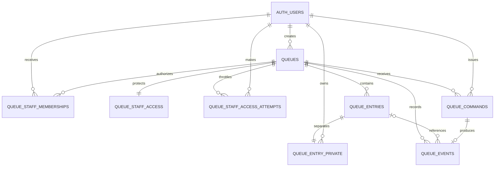

# Data model

## Responsibilities

- `queues`: public slug/name/prefix/status, next sequence, monotonic revision, creator, timestamps.
- `queue_entries`: display-safe stable number, state timestamps, and changing revision. It never stores customer identity/name or mutable position.
- `queue_entry_private`: customer UUID and optional normalized display name.
- `queue_staff_memberships`: the database authorization fact for staff commands and private-name reads.
- `queue_staff_access`: one bcrypt-compatible `pgcrypto` hash per queue; the raw code is returned once and never persisted.
- `queue_staff_access_attempts`: per-user/per-queue 15-minute failure window and block.
- `queue_commands`: request UUID, actor, queue, and command type for idempotency.
- `queue_events`: append-only transition type, entry reference, actor, request, and queue revision.

## Constraints and indexes

Slugs, names, prefixes, positive sequences, nonnegative revisions, labels, and state/timestamp combinations have checks. Queue sequence/label pairs are unique. `queue_entries_one_serving_idx` is a partial unique index on `queue_id where status = 'SERVING'`. Waiting order, status, customer ownership, staff membership, attempts, commands, and event revisions have deliberate indexes. `queue_events_queue_revision_idx` makes event revisions unique per queue.

Only `queues` and `queue_entries` are published to Realtime. Private names, ownership, memberships, hashes, attempts, command receipts, and events are excluded.
